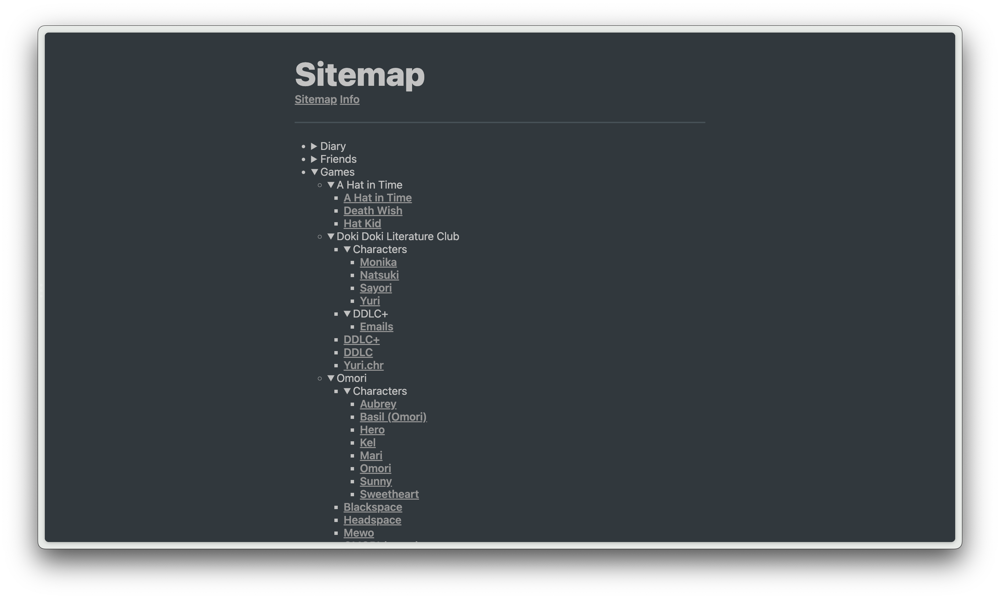
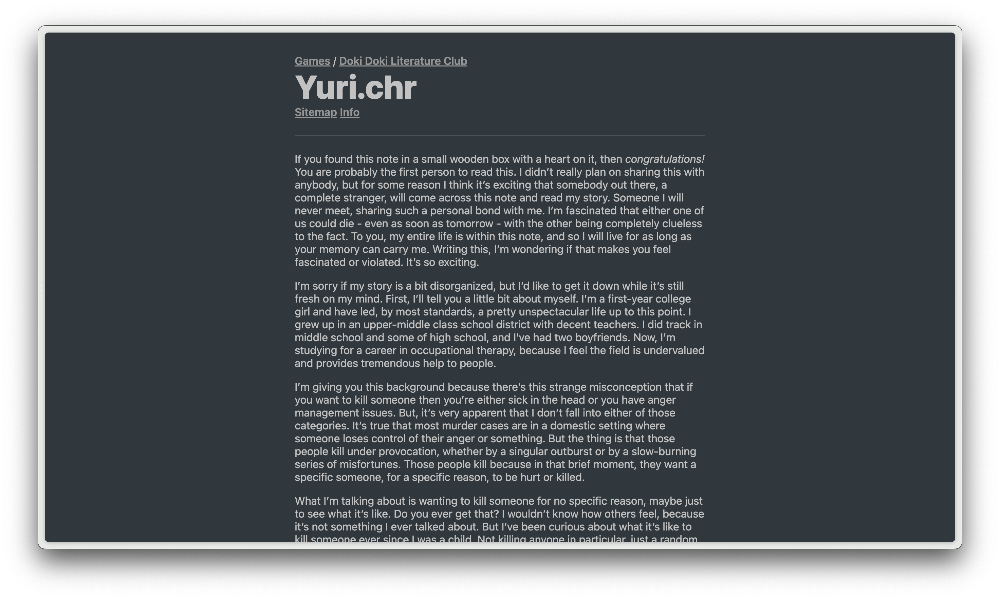

# ⭐ Anise

A simplistic alternative to [Obsidian Publish](https://obsidian.md/publish) and [Quartz](https://github.com/jackyzha0/quartz). Made over the weekend with [Astro](https://astro.build), for fun.

## Building

To prepare your vault for Anise, download my slightly tweaked version of the plugin [obsidian-link-converter](https://github.com/ozntel/obsidian-link-converter) from the `olc` directory and run the `Obsidian Link Converter: Vault: Links to Markdown` command from the command palette. Copy the vault to `vault` in this directory, install Node.js and Yarn, and run `yarn build`. The static site is now in `dist`, do whatever you want with it.

## Known Issues

Markdown parsing is hard. Although I use a remark plugin to fix some things, there are some other things that just don't work. For example:

- Embedding videos (they embed as images, therefore don't work)
- Embedding audio (didn't test, presumably also doesn't work)
- Sometimes fails to remove the ".md" from a link in a page. In those cases, removing it will fix it.

## Potential Improvements

- Fixing aforementioned issues
- Better icon for external links instead of emoji
- Don't require the use of the converter plugin
- Backlinks
